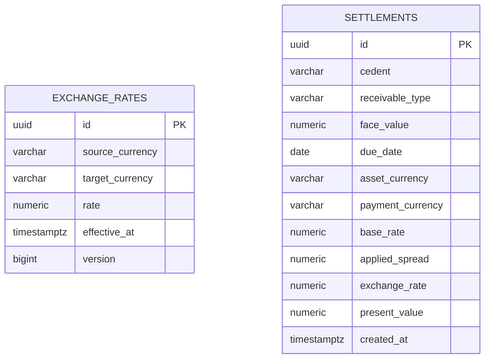

# SRM Credit Engine

Plataforma para simular e liquidar cessões de crédito multimoedas (BRL e USD). O sistema calcula o valor presente de recebíveis, aplica a taxa de câmbio quando necessário e registra a liquidação de forma auditável.

## Stack

- Java 21, Spring Boot 3, JPA e Flyway
- PostgreSQL 16
- Angular 16 e TypeScript
- Docker Compose

## Arquitetura

```text
Angular (operador) → API REST Spring Boot → PostgreSQL
                         │
                         ├─ application: casos de uso e transações
                         ├─ domain: strategies de precificação
                         └─ infrastructure: JPA, Flyway e configurações
```

No frontend, `components/` reúne elementos reutilizáveis de interface e `core/` concentra contratos e acesso HTTP.

## Fluxos de negócio

### Simulação

1. O operador informa cedente, valor, tipo, vencimento, taxa base e moedas.
2. Com dados válidos, o painel dispara a simulação automaticamente.
3. A API escolhe a strategy pelo tipo de recebível, calcula o valor presente e converte para a moeda de pagamento quando necessário.

### Liquidação

1. O operador cadastra uma taxa de câmbio se as moedas forem diferentes.
2. Confirma a liquidação.
3. A API calcula novamente, persiste valor, spread, câmbio e vencimento em uma transação única.
4. O extrato pode ser filtrado e paginado.

## Fórmula e convenções financeiras

`valor presente = valor de face / (1 + taxa base + spread)^períodos`

- Duplicata mercantil: spread de 1,5% a.m. (`0.015`).
- Cheque pré-datado: spread de 2,5% a.m. (`0.025`).
- Taxas são decimais: `0.01` equivale a 1% ao mês.
- O vencimento é a fonte de verdade. O motor calcula internamente períodos de 30 dias, arredondados para cima; esse detalhe não é exposto no contrato da API.
- A cotação é multiplicada ao valor presente apenas depois da precificação. Exemplo: uma taxa BRL/USD de `0.20` significa 1 BRL = 0,20 USD.
- Valores monetários usam `BigDecimal`, escala de quatro casas e arredondamento `HALF_UP`.

## Diagrama ER



## Executar

Pré-requisito: Docker Desktop em execução.

```bash
docker compose up --build
```

| Serviço | Endereço |
|---|---|
| Painel | http://localhost:4200 |
| API | http://localhost:8080 |
| Swagger | http://localhost:8080/swagger-ui.html |
| PostgreSQL | localhost:5432 |

O Compose sobe frontend, API e PostgreSQL. Flyway aplica as migrations automaticamente.

## Endpoints e exemplos

| Método | Rota | Finalidade |
|---|---|---|
| POST | `/api/v1/exchange-rates` | Cadastra uma taxa |
| POST | `/api/v1/pricing/simulations` | Calcula uma simulação |
| POST | `/api/v1/settlements` | Liquida uma operação |
| GET | `/api/v1/settlements` | Extrato com filtros e paginação |

Cadastrar taxa BRL/USD:

```json
{"sourceCurrency":"BRL","targetCurrency":"USD","rate":0.20}
```

Simular:

```json
{
  "faceValue": 1000.00,
  "receivableType": "DUPLICATA_MERCANTIL",
  "dueDate": "2026-08-18",
  "baseRate": 0.01,
  "assetCurrency": "BRL",
  "paymentCurrency": "USD"
}
```

Liquidar:

```json
{
  "cedent": "Empresa Exemplo Ltda",
  "pricing": { "faceValue": 1000.00, "receivableType": "DUPLICATA_MERCANTIL", "dueDate": "2026-08-18", "baseRate": 0.01, "assetCurrency": "BRL", "paymentCurrency": "USD" }
}
```

## Testes

O backend cobre strategies, prazo zero, múltiplos períodos, vencimento, câmbio, cotação ausente/vigente, persistência e falha antes da persistência.

```bash
# backend, usando imagem Maven
docker run --rm -v "${PWD}/backend:/app" -w /app maven:3.9.9-eclipse-temurin-21 mvn test

# frontend, após instalar dependências locais
cd frontend
npm test -- --watch=false
```

## Decisões e trade-offs

- Monólito em camadas: suficiente para o case e mais simples de executar que microserviços.
- PostgreSQL: transações ACID e precisão numérica adequadas ao domínio financeiro.
- Strategy Pattern: permite adicionar novos tipos de recebível sem condicionar o motor central.
- Câmbio manual: demonstra o domínio sem dependência de fornecedor externo; uma integração real exigiria timeout, retry e circuit breaker.
- Frontend compilado no Docker: evita bloqueios locais de `node_modules` pelo OneDrive.

## Critérios de aceite

- Valores financeiros calculados com precisão decimal.
- Vencimento atual ou futuro; datas passadas são bloqueadas na interface e validadas na API.
- Liquidação persistida de forma atômica.
- Taxa de câmbio vigente, nunca futura.
- Extrato com filtros por cedente, moeda e período, além de paginação.
- Serviços sobem com um comando Docker Compose.

## Limitações conhecidas e evolução

- Não há autenticação de operadores nem perfis de autorização.
- A liquidação ainda não possui chave de idempotência para bloquear requisições repetidas de forma definitiva.
- Não há integração externa de câmbio, observabilidade com métricas ou pipeline CI/CD.
- Evoluções recomendadas: JWT/RBAC, idempotência, optimistic locking na liquidação, GitHub Actions, Actuator/Prometheus e integração resiliente de cotação.

## Documentos complementares

- [Arquitetura e critérios de aceite](docs/architecture.md)
- [Diagrama ER](docs/er-diagram.md)
- [Registro de uso de IA](AI_USAGE.md)
