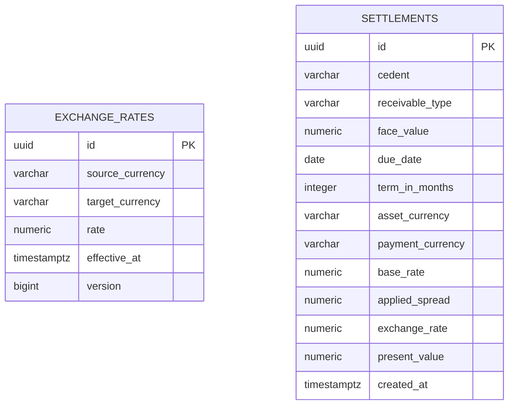

# Diagrama ER

```mermaid
erDiagram
    EXCHANGE_RATES {
        uuid id PK
        varchar source_currency
        varchar target_currency
        numeric rate
        timestamptz effective_at
        bigint version
    }

    SETTLEMENTS {
        uuid id PK
        varchar cedent
        varchar receivable_type
        numeric face_value
        date due_date
        integer term_in_months
        varchar asset_currency
        varchar payment_currency
        numeric base_rate
        numeric applied_spread
        numeric exchange_rate
        numeric present_value
        timestamptz created_at
    }
```

`exchange_rate` é armazenada na liquidação para preservar a cotação usada no momento do cálculo, mesmo que uma taxa futura seja cadastrada.
