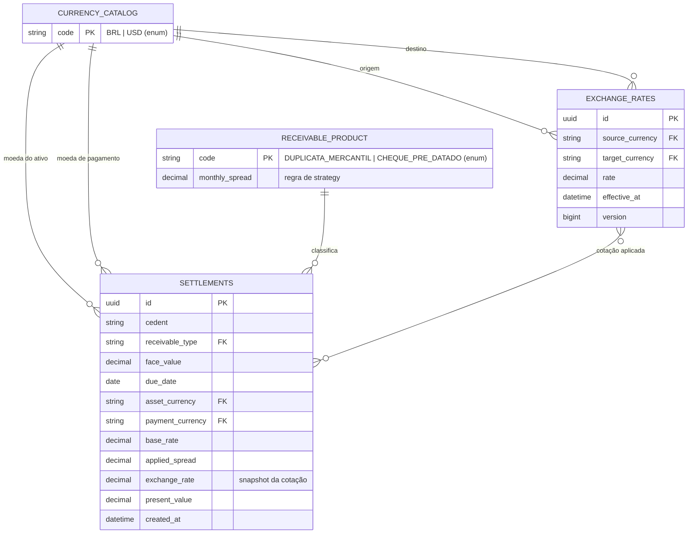

# Diagrama ER e catálogos de domínio

Nesta versão, **Moeda** e **Produto/Tipo de Recebível** são catálogos lógicos implementados por enums no código. Isso reduz complexidade no MVP sem perder a integridade dos valores aceitos. As tabelas persistidas são Taxas de Câmbio e Liquidações.

## Relações e auditoria

- Uma moeda pode participar de várias taxas, tanto como origem quanto como destino.
- Um produto/tipo de recebível classifica várias liquidações e determina a strategy de spread.
- Uma liquidação registra um **snapshot** do spread e da cotação usados; ela não depende de uma taxa futura para reproduzir o valor liquidado.
- A aplicação consulta somente taxa com `effective_at <= instante da operação`, ordenada da mais recente para a mais antiga.

## DDL

O DDL versionado está em `backend/src/main/resources/db/migration/`:

- `V1__create_credit_engine_tables.sql`: cria `exchange_rates` e `settlements`.
- `V2__add_settlement_due_date.sql`: adiciona vencimento e remove o campo técnico de prazo da estrutura final.
